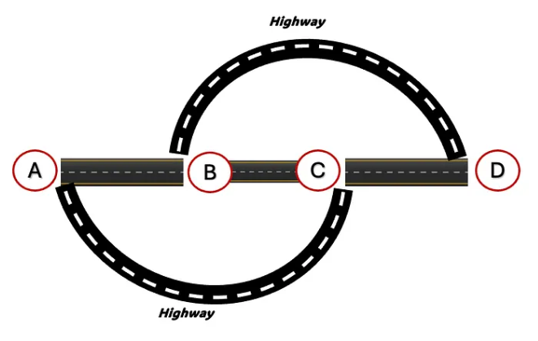

# Analiza problemu i dziedziny
Celem jest zbadanie i zidentyfikowanie fragmentów sieci drogowej w wybranym obszarze,
których zamknięcie mogłoby paradoksalnie poprawić płynność ruchu, zgodnie z tzw. paradoksem Braessa. 

### Paradoks Braessa
Paradoks Braessa to zjawisko w sieciach drogowych, opisane przez Dietrich Braess, polegające na tym, że dodanie nowego odcinka drogi może prowadzić do pogorszenia ogólnej przepustowości i wydłużenia czasu przejazdu.

W modelu ruchu drogowego zakłada się, że kierowcy wybierają trasy w sposób indywidualny, minimalizując własny czas podróży. W takich warunkach sieć osiąga stan równowagi, określany jako Nash equilibrium, w którym żaden użytkownik nie może poprawić swojej sytuacji poprzez jednostronną zmianę trasy.

Paradoks polega na tym, że zmiana struktury sieci (np. dodanie nowej drogi) prowadzi do nowej równowagi, która — mimo racjonalnych decyzji poszczególnych kierowców — może być mniej efektywna globalnie. W konsekwencji średnie czasy przejazdu w sieci mogą wzrosnąć, mimo zwiększenia jej infrastruktury.

Na przedstawionym schemacie odcinki A–B oraz C–D mają czas przejazdu równy T/100 minut, gdzie T oznacza liczbę samochodów na drodze. \
Odcinek B–C ma stały czas przejazdu wynoszący 1 minutę, natomiast każda z autostrad (górna i dolna) zajmuje 25 minut. \
W tej konfiguracji czas przejazdu z punktu A do D, przy wyborze trasy przez odcinek B–C, wynosi 41 minut. Alternatywne trasy (bez korzystania z B–C) zajmują 45 minut. \
Po usunięciu odcinka B–C kierowcy są zmuszeni do wyboru jednej z dwóch pozostałych tras. Przy równomiernym rozkładzie ruchu (po 1000 pojazdów na każdą trasę) czas przejazdu skraca się do 35 minut.

### Przykłady występowania paradoksu Braessa w rzeczywistości

1. Seoul (Korea Południowa) -
usunięcie sześciopasmowej autostrady w centrum miasta doprowadziło do skrócenia czasu przejazdu, mimo że całkowity ruch samochodowy pozostał na podobnym poziomie. Kierowcy zmienili swoje trasy w sposób bardziej efektywny dla całej sieci.

2. Boston (USA) - analizy wykazały, że zamknięcie wybranych ulic (m.in. fragmentów Charles i Main Street) mogłoby zmniejszyć opóźnienia w ruchu. Ograniczenie dostępnych tras zmusiłoby kierowców do bardziej równomiernego rozkładu w sieci.

3. New York City (USA) - podczas Earth Day w 1990 roku tymczasowo zamknięto jedną z głównych ulic (42nd Street). Efektem było zmniejszenie poziomu korków w okolicy, zamiast wzrostu.

## Istniejące projekty symulacji
- Proste symulacja Paradoksu Braessa [JavaScript](https://github.com/bit-player/traffic?tab=readme-ov-file), [NetLogo](https://www.netlogoweb.org/launch#https://www.netlogoweb.org/assets/modelslib/Sample%20Models/Social%20Science/Economics/Braess%20Paradox.nlogox)
- [Detekcja paradoxu za pomocą danych CO2](https://github.com/Simoniuss/Braess-Paradox-Framework)

## Bibliografia
- https://www.researchgate.net/publication/331444898_Is_it_time_to_go_for_no-car_zone_policies_Braess_Paradox_Detection
- https://en.wikipedia.org/wiki/Braess%27s_paradox
- https://medium.com/@atinvento/when-more-roads-mean-more-traffic-braess-paradox-and-bangalores-never-ending-traffic-dd94fcd9047c 