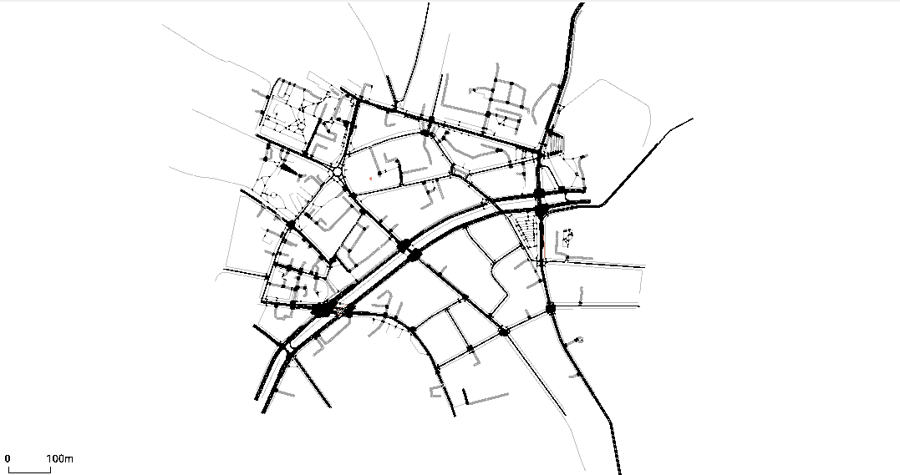
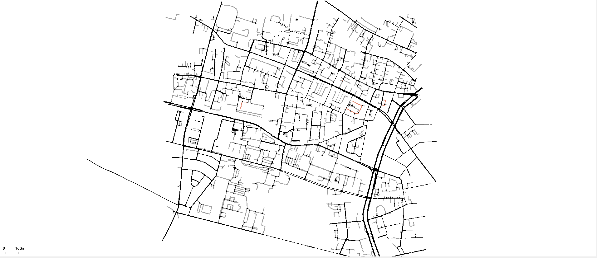

# Testy symulacji w SUMO


Etap drugi to **wstępne testy funkcjonalności SUMO** - weryfikacja czy platforma umożliwia realizację projektu. W tym etapie:
- Pobrano fragmenty sieci drogowej Krakowa z OpenStreetMap oraz Overpass turbo eu
- Przeprowadzono konwersję danych OSM → SUMO
- Wygenerowano trasy dla obu scenariuszy
- Wygenerowanie prostych testów


## Pobieranie danych

W celu przetestowania działania pobrałem dwa fragmenty Krakowa. Dane pobierano z dwóch źródeł:
 
### Fragment 1: frag_krakow_1.osm (mały fragment - OpenStreetMap)
 
Mniejszy fragment pobrano bezpośrednio z serwisu OpenStreetMap (openstreetmap.org) w celu testów:
 

 
Fragment ten był wystarczający dla wstępnych testów konwersji i sprawdzenia czy SUMO w ogóle obsługuje dane.
 
### Fragment 2: frag_krakow_2.osm (większy fragment - Overpass Turbo)
 
W celu uzyskania większego fragmentu Krakowa OpenStreetMap posiadał limity co do wielkości danego obszaru. W tym celu wykorzystałem Overpass Turbo (https://overpass-turbo.eu/), który umożliwił mi za pomocą zapytania uzykać większy obszar:
 
```
[out:xml][timeout:100];
(
  way["highway"]
    ["highway"!="footway"]
    ["highway"!="pedestrian"]
    ["highway"!="path"]
    ["highway"!="cycleway"]
    ["highway"!="steps"]
    (50.05890,19.90199,50.07659,19.92877);
  node["highway"="traffic_signals"]
    (50.05890,19.90199,50.07659,19.92877);
)->.roads;
(.roads;>;)->.all;
.all out meta;
```

Zastosowano końcową część zapytania (.roads;>;)->.all;, aby pobrać pełną strukturę danych (najpierw obiekty dróg, a następnie wszystkie ich węzły), co jest wymagane przez SUMO do poprawnego zbudowania grafu sieci.
Bez zachowania tej kolejności dane pozostają niekompletne — JOSM (edytor map OpenStreetMap) potrafi je wyświetlić, jednak SUMO nie jest w stanie ich prawidłowo przetworzyć.
 
**Obszar testowy:**
- Szerokość geograficzna: 50.05890 - 50.07659
- Długość geograficzna: 19.90199 - 19.92877




Zapytanie wyizolowało wszystkie główne drogi (wyłączając ścieżki piesze, rowerowe i schody) oraz sygnalizację świetlną w wybranym obszarze. Wynik zapisywano jako `frag_krakow_2.osm`.

### Konwersja do formatu SUMO
 

 
Konwersja z formatu OSM do natywnego formatu SUMO (.net.xml) przeprowadzono za pomocą `netconvert`. Podczas testów użyto fragmentów `frag_krakow_1.osm` i ostatecznie `frag_krakow_2.osm`:
 
```bash
netconvert --osm-files osm/frag_krakow_2.osm \
           --output-file net_xml/frag_krakow_2.net.xml \
           --geometry.remove \
           --roundabouts.guess \
           --ramps.guess \
           --junctions.join \
           --tls.guess-signals \
           --tls.discard-simple
```
 
**Parametry konwersji:**
- `--geometry.remove` - Uproszczenie geometrii
- `--roundabouts.guess` - Automatyczne rozpoznawanie rond
- `--ramps.guess` - Rozpoznawanie podjazdów
- `--junctions.join` - Łączenie bliskich skrzyżowań
- `--tls.guess-signals` - Automatyczne rozpoznawanie sygnalizacji
- `--tls.discard-simple` - Odrzucanie prostych skrzyżowań bez sygnalizacji

 
## Tworzenie tras przejazu 

### Generowanie ruchu
 
Do testów wygenerowano losowe trasy dla pojazdów za pomocą skryptu `randomTrips.py` z SUMO.

```bash
python "C:\Program Files (x86)\Eclipse\Sumo\tools\randomTrips.py" \
       -n "net_xml\frag_krakow_2.net.xml" \
       -o "trips\trips2.xml" \
       -r "routes\routes2.xml" \
       -e 3600
```
 
**Parametry:**
- `-n` - Plik sieci SUMO (.net.xml)
- `-o` - Wyjściowy plik z podróżami (.xml)
- `-r` - Wyjściowy plik z trasami (.xml)
- `-e 3600` - Długość symulacji (3600 sekund = 1 godzina)
### Uruchomienie symulacji
 
Symulację uruchomiono za pomocą:
 
```bash
sumo -c sim2.sumocfg
```
 
### Wyniki testów
 
Prosta analiza wyników przeprowadzono za pomocą programu analyze.py:
 
```python
import xml.etree.ElementTree as ET
 
def analyze(file, nazwa):
    tree = ET.parse(file)
    pojazdy = tree.findall('tripinfo')
 
    durations = [float(t.get('duration')) for t in pojazdy]
    waiting = [float(t.get('waitingTime')) for t in pojazdy]
 
    print(f'\n=== {nazwa} ===')
    print(f'Liczba pojazdow (ukonczone):  {len(pojazdy)}')
    print(f'Sredni czas przejazdu:        {sum(durations)/len(durations):.2f} s')
    print(f'Sredni czas czekania:         {sum(waiting)/len(waiting):.2f} s')
 
analyze('output/tripinfo2.xml', 'Siec oryginalna')
```
 
## Wnioski
 
1. SUMO umożliwia prawidłową konwersję danych OSM do formatu symulacyjnego
2. System generuje poprawne scenariusze ruchu i podróży
3. Plik wyjściowe zawierają wystarczające dane do analizy (czasy przejazdu, czasy czekania, liczba pojazdów)