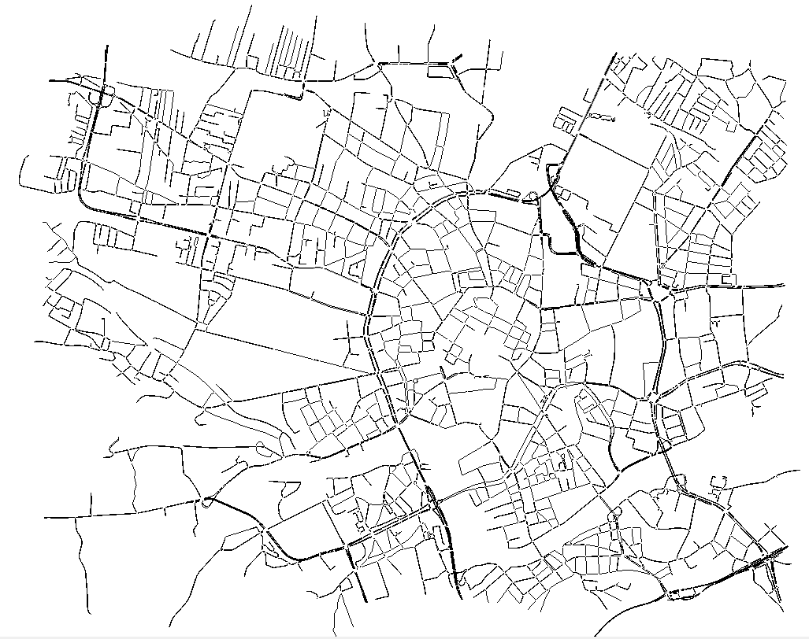

# Symulacja i koncepcja wykrywania Paradoksu Braessa – Etap 3

W kolejnym etapie została stworzona baza do symulacji ruchu drogowego na podanym fragmencie oraz koncepcję algorytmu szukającego paradoks.

## Sieć drogowa

Fragment Krakowa pobrany z Overpass-Turbo:



---

## Pliki projektu

### `get_data_sumo.py`
Pobiera dane OpenStreetMap przez Overpass API dla zadanego bounding boxa i konwertuje je do formatu sieciowego SUMO przy użyciu `netconvert`. Filtruje tylko drogi dostępne dla samochodów osobowych (`passenger`), usuwa izolowane krawędzie i scala skrzyżowania. Wynikiem jest plik `.net.xml` gotowy do symulacji.

### `generate_trips.py`
Generuje losowe podróże dla pojazdów w sieci. Krawędziom przypisywane są wagi zależne od klasy drogi – im ważniejsza droga, tym większe prawdopodobieństwo wyboru jako punkt startowy/końcowy. Trasy wyznaczane są przez `duarouter`.

| Typ drogi | Waga |
|---|---|
| highway.primary | 50.0 |
| highway.primary_link | 40.0 |
| highway.secondary | 20.0 |
| highway.secondary_link | 15.0 |
| highway.tertiary | 10.0 |
| highway.tertiary_link | 10.0 |
| highway.service | 8.0 |
| highway.service (transport publiczny) | 8.0 |
| highway.unclassified | 3.0 |
| highway.residential | 2.0 |
| highway.living_street | 1.0 |
| highway.track | 1.0 |

### `simulation.py`
Uruchamia dwa scenariusze symulacji SUMO:
- **Scenariusz A** – pełna sieć drogowa
- **Scenariusz B** – sieć z usuniętą wybraną krawędzią (`netconvert --remove-edges.explicit`)

Dla każdego scenariusza zbierane są: `tripinfo.xml`, `summary.xml` oraz `edge_data.xml`.

### `analyze_results.py`
Porównuje wyniki obu scenariuszy – oblicza zmiany w średnim czasie podróży, łącznej stracie czasu, czasie oczekiwania i liczbie ukończonych podróży. Wypisuje ranking najbardziej zatłoczonych krawędzi według occupancy (% czasu zajętości krawędzi).


---

## Koncepcja algorytmu wykrywania kandydatów

```
1. START
   Symulacja pełnej sieci → TTT, completed, poziom zakorkowania (occupancy) dla krawędzi
   Z edge_data wybieramy top-20 krawędzi po poziom zakorkowania jako kandydatów

2. TESTOWANIE KANDYDATÓW
   Dla każdej z 20 krawędzi:
   Usuwamy krawędź, tworzymy nowe trasy → symulacja → TTT_i, completed_i, occupancy_i

   Warunki:
   TTT_i < TTT             
   completed_i ≈ completed
   occupancy_i ≤ occupancy

   Wszystkie spełnione  →  kandydat do zamknięcia
   Którykolwiek niespełniony  →  odrzuć

3. WYNIK
   Lista usuniętych krawędzi poprawiających sieć
```
---

