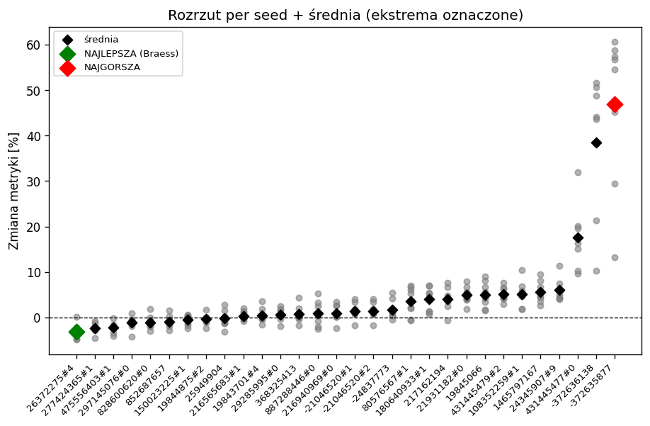
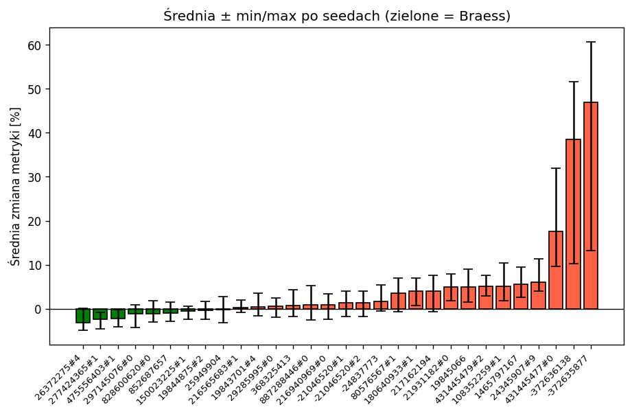

# Paradoks Braessa – Etap 6

Etap 6 rozszerza poprzedni o automatyczny skan dużej liczby krawędzi na wielu
seedach, weryfikację zachowania tras (start/koniec) oraz testy usuwania wielu
krawędzi naraz (kombinacje podwójne i potrójne). Logika generowania ruchu,
routingu i metryk jest importowana z Etapu 5 — nie była przepisywana.

---

## Pliki utworzone w tym etapie

1. **[`braessSearchFull.py`](braessSearchFull.py)** – główny skrypt skanu,
   podzielony na etapy włączane flagami w `__main__`:
   - `STAGE_BASELINE` – generuje baseline (tripy, trasy, symulacja) dla każdego
     seeda osobno (`output/baseline_seedXXX`),
   - `STAGE_PICK` – wybiera top 30 najbardziej obciążonych krawędzi (occupancy),
   - `STAGE_RUN` – test bazowy: usuwa pojedynczo każdą z top 30 krawędzi na
     wszystkich seedach, liczy metrykę i zapisuje wyniki,
   - `STAGE_BEST` / `STAGE_WORST` / `STAGE_MIX` / `STAGE_RAND3` – testy
     kombinacji (usuwanie wielu krawędzi naraz) na jednym ustalonym seedzie.

2. **[`statsBraessSimulation.py`](statsBraessSimulation.py)** – statystyki i
   wykresy z `output/results.csv`:
   - agregacja testu bazowego per krawędź (średnia %, ile seedów polepszyło,
     flaga BRAESS gdy wszystkie seedy poprawiły),
   - ekstrema (najlepsza / najgorsza krawędź),
   - statystyki per test kombinacji (średnia %, polepszyło X/N, najlepszy i
     najgorszy zestaw),
   - liczba tras ze zmienionym start/koniec (`stage_route_changes`),
   - wykresy `scatter_mean.png` i `bars_mean_err.png`.

3. **[`verifyTrips.py`](verifyTrips.py)** – weryfikacja zachowania tras:
   porównuje pary (start, koniec) tras baseline i scenariusza, zwraca `True`
   gdy każda para ze scenariusza istnieje w baseline (z korektą o krawędzie
   leżące na usuniętym odcinku). Używana też przez statystyki do liczenia
   zmian start/koniec.

Wyniki zapisywane do [`output/`](output/): zbiorczy `results.csv`, pliki
tekstowe per krawędź w `output/results/`, wykresy w `output/plots/`.

---

## Przeprowadzone testy

### Test bazowy (single-edge)
8 seedów (144, 42, 200, 777, 1337, 2024, 7, 99), ~16400 pojazdów na symulację.
Dla każdej z top 30 najbardziej obciążonych krawędzi usuwano ją pojedynczo i
porównywano metrykę (suma czasów przejazdu + kara 3600s za nieukończone) z
baselinem danego seeda.

### Testy kombinacji (multi-edge, ustalony seed)
Usuwanie wielu krawędzi naraz w jednej symulacji, po 10 zestawów każdy
(bez powtórzeń zestawów):
- **best** – top 2 najlepsze krawędzie + po 2 losowe z top 15 najlepszych,
- **worst** – top 2 najgorsze + po 2 losowe z top 15 najgorszych,
- **mix** – 1 losowa z najlepszych + 1 losowa z najgorszych,
- **rand3** – 3 losowe krawędzie z top 30.

---

## Wyniki – test bazowy

Top kandydaci (najmocniej poprawiający) i najgorsi (najmocniej pogarszający):

| Krawędź | Śr. zmiana | Polepszyło | BRAESS |
|---|---|---|---|
| `26372275#4` | **-3.14%** | 7/8 | nie |
| `277424365#1` | **-2.40%** | 8/8 | **tak** |
| `475556403#1` | **-2.29%** | 8/8 | **tak** |
| `297145076#0` | -1.15% | 7/8 | nie |
| `828600620#0` | -1.10% | 7/8 | nie |
| ... | ... | ... | ... |
| `431445477#0` | +17.59% | 0/8 | nie |
| `-372636138` | +38.56% | 0/8 | nie |
| `-372635877` | +46.99% | 0/8 | nie |

Wnioski:
- **`277424365#1` i `475556403#1`** poprawiają ruch we **wszystkich 8 seedach**
  (flaga BRAESS = tak) — to najpewniejsi kandydaci na paradoks Braessa.
  `475556403#1` był już wskazany w Etapie 5, więc wynik się potwierdza na
  większej liczbie seedów.
- Najgorsze krawędzie (`-372635877`, `-372636138`, `431445477#0`) to kluczowe
  arterie — ich usunięcie drastycznie pogarsza ruch (+47%, +39%, +18%).

#### Przypadek `26372275#4` (najniższa średnia, ale 7/8)

`26372275#4` ma **najniższą średnią zmianę (-3.14%)**, czyli przeciętnie
najmocniej poprawia ruch — ale tylko w 7 z 8 seedów (jeden seed wyszedł
nieznacznie na plus), więc formalnie nie dostaje flagi BRAESS, w
przeciwieństwie do `277424365#1`/`475556403#1` (8/8, ale słabsza średnia).

Możliwe przyczyny tej rozbieżności:
- **Pojedynczy seed jako odstający** – dla jednego rozkładu par źródło–cel
  usunięcie tej krawędzi akurat zepchnęło ruch na trasę, która lokalnie się
  zapchała. To typowy szum przy zależności wyniku od konkretnego losowania
  popytu.
- **Krawędź „graniczna" efektu Braessa** – `26372275#4` daje silny efekt, gdy
  ruch jest rozłożony w określony sposób, ale jest go pozbawiona, gdy popyt
  trafia gdzie indziej. Stąd duża średnia poprawa, lecz mniejsza spójność.
- **Czułość metryki na nieukończone** – kara 3600 s za pojazd jest duża;
  pojedynczy seed, w którym kilka dodatkowych pojazdów nie dotarło do celu,
  potrafi przeważyć poprawę czasów pozostałych przejazdów i odwrócić znak.

Praktyczny wniosek: **średnia i spójność (X/N) to dwa różne kryteria** i warto
patrzeć na oba. `277424365#1`/`475556403#1` są „bezpieczniejszymi" kandydatami
(zawsze poprawiają), a `26372275#4` ma większy potencjał, ale wymaga
potwierdzenia na większej liczbie seedów, by wykluczyć przypadek odstający.

### Wykresy

**Rozrzut per seed + średnia (`output/plots/scatter_mean.png`)**

Każdy szary punkt to wynik dla jednego seeda, czarny romb to średnia danej
krawędzi, zielony/czerwony romb oznacza ekstrema (najlepsza/najgorsza).
Wykres pokazuje trzy rzeczy:
- krawędzie poprawiające ruch (ujemne) to **wąska grupa po lewej** — paradoks
  Braessa jest rzadki,
- dla większości krawędzi punkty są ciasno skupione wokół średniej (mały
  rozrzut między seedami = wynik wiarygodny),
- po prawej kilka krawędzi krytycznych z ogromnym rozrzutem dodatnim — ich
  usunięcie czasem prawie paraliżuje sieć.

**Średnia ± min/max po seedach (`output/plots/bars_mean_err.png`)**

Słupki posortowane rosnąco; zielone = poprawa (Braess), czerwone =
pogorszenie. Wąsy to zakres min–max po 8 seedach. Widać wyraźny, rosnący
„ogon" krawędzi krytycznych po prawej (`431445477#0`, `-372636138`,
`-372635877`) — to arterie, których usunięcie pogarsza ruch o kilkadziesiąt
procent, podczas gdy efekt Braessa po lewej to zaledwie kilka procent.

---

## Wyniki – testy kombinacji (podwójne / potrójne)

*(sekcja do uzupełnienia po przeliczeniu testów best / worst / mix / rand3)*

| Test | Średnia % | Polepszyło | Najlepszy zestaw | Najgorszy zestaw |
|---|---|---|---|---|
| best |  |  |  |  |
| worst |  |  |  |  |
| mix |  |  |  |  |
| rand3 |  |  |  |  |

Pytania badawcze do tej sekcji:
- czy usunięcie kilku „dobrych" krawędzi naraz sumuje efekt Braessa, czy się
  znosi,
- czy usuwanie najgorszych krawędzi zawsze pogarsza tak samo,
- jak zachowuje się losowa kombinacja względem celowanej.

---

## Problemy i obserwacje

### Zmiana start/koniec tras a `--repair`
Weryfikacja porównująca pary (start, koniec) baseline vs scenariusz pokazała,
że **zdecydowana większość tras zachowuje to samo źródło i cel** — zmienia się
tylko trasa pomiędzy (objazd), co jest pożądane. Przykładowo dla jednej krawędzi
na ~131k sprawdzonych przejazdów ~121k miało niezmieniony start i koniec.

Część tras miała jednak zmieniony **start** (~4.4k), **koniec** (~4.4k) lub
**oba** (~0.2k), a niewielka grupa (~0.6k) w ogóle nie pojawiła się w
scenariuszu. Przyczyny:
- **`--repair.from` / `--repair.to`** – gdy źródło lub cel pojazdu leżał na
  usuniętej krawędzi, `duarouter` przesuwał punkt początkowy/końcowy na
  najbliższy przejezdny odcinek, tworząc nową parę (start, koniec).
- **`--weights.random-factor 4`** – losowe zaburzanie kosztów krawędzi
  powoduje, że nawet trasy niezwiązane z usuniętą krawędzią mogą wjeżdżać lub
  wyjeżdżać innym **segmentem** tej samej ulicy (np. `12345#2` zamiast
  `12345#3`); fizycznie ten sam punkt, ale inny identyfikator → liczone jako
  zmiana.
- **`--remove-loops`** – przycinanie pętli na końcach trasy potrafi zmienić
  pierwszą lub ostatnią krawędź.
- pojazdy, których trasy nie dało się naprawić, są **odrzucane** i otrzymują
  karę w metryce.

Wniosek: zmiany start/koniec to w większości artefakt sposobu generowania tras
(segmentacja krawędzi + losowość routingu), a nie realna zmiana relacji
źródło–cel. Dla „czystego" porównania można by wyłączyć `--repair.from/to` oraz
`--weights.random-factor`, kosztem mniejszej różnorodności tras.

### Inne
- Pełny skan (top 30 × 8 seedów) jest kosztowny obliczeniowo (~6 h) — testy
  kombinacji świadomie ograniczono do jednego ustalonego seeda.
- Wyniki dopisywane są do `results.csv`; przy ponownym uruchomieniu tego samego
  testu należy najpierw usunąć stare wiersze, aby uniknąć podwójnego liczenia.

---

## Wnioski

- Udało się **zautomatyzować** wykrywanie kandydatów na paradoks Braessa na
  dużej próbie (30 krawędzi) i zweryfikować je statystycznie na 8 seedach.
- Potwierdzono **dwie krawędzie spójnie wykazujące paradoks Braessa**
  (`277424365#1`, `475556403#1` — 8/8 seedów), co jest mocniejszym wynikiem niż
  pojedynczy kandydat z Etapu 5.
- Weryfikacja tras potwierdziła, że metoda zachowuje pary źródło–cel dla
  ~93% pojazdów; rozbieżności wyjaśniono mechanizmem `--repair` i losowości
  routingu.
- Przygotowano ramy do badania **kombinacji** usunięć (podwójne, potrójne),
  które pozwolą sprawdzić, czy efekt Braessa się kumuluje.

---

## Dalsze kierunki

- **Więcej seedów dla kandydatów granicznych** – `26372275#4` (7/8) i pozostałe
  krawędzie z wysoką średnią, ale niepełną spójnością, warto przeliczyć na
  20–30 seedach, by odróżnić rzeczywisty efekt Braessa od pojedynczego
  odstającego wyniku.
- **Dokończenie testów kombinacji** – sprawdzić, czy usunięcie kilku „dobrych"
  krawędzi naraz sumuje poprawę, czy efekty się znoszą (np. dwie krawędzie
  poprawiające osobno mogą razem przekierować ruch na wspólne wąskie gardło).
- **Czystszy routing dla porównań** – wariant generowania bez
  `--repair.from/to` i bez `--weights.random-factor`, żeby pary źródło–cel były
  identyczne jak w baseline; pozwoli oddzielić efekt Braessa od artefaktów
  routingu (zmiany start/koniec).
- **Zależność od natężenia ruchu** – powtórzyć skan dla kilku poziomów popytu
  (mniej/więcej pojazdów) i sprawdzić, przy jakim zatłoczeniu efekt Braessa dla
  `277424365#1`/`475556403#1` jest najsilniejszy — paradoks zwykle ujawnia się
  dopiero powyżej pewnego obciążenia.
- **Analiza przestrzenna** – nałożyć krawędzie poprawiające/pogarszające na mapę
  sieci, żeby sprawdzić, czy kandydaci na Braessa tworzą sensowny wzorzec
  (np. skróty równoległe do głównych arterii).
- **Walidacja metryki** – sprawdzić wrażliwość wyników na wysokość kary za
  nieukończone przejazdy (3600 s) oraz na `--time-to-teleport`, bo to one
  najmocniej wpływają na znak zmiany przy seedach granicznych.
